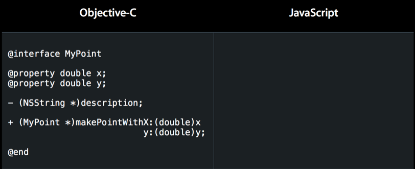

# JavaScriptCore笔记


## 一、概览

- JavaScriptCore 简介
- Objective-C 与 JavaScript 交互
- JavaScript 与 Objective-C 交互
- 内存管理
- 多线程


##二、JavaScriptCore 简介


###1、JavaScriptCore 和 JavaScriptCore 框架

首先要区分**JavaScriptCore** 和 **JavaScriptCore框架**（同后文中的JSCore）

- **JavaScriptCore框架** 是一个苹果在iOS7引入的框架，该框架让 Objective-C 和 JavaScript 代码直接的交互变得更加的简单方便。

- **JavaScriptCore** 是苹果Safari浏览器的JavaScript引擎，或许你听过Google的V8引擎，在WWDC上苹果演示了最新的Safari，据说JavaScript处理速度已经大大超越了Google的Chrome，这就意味着JavaScriptCore在性能上也不输V8了。
- **JavaScriptCore框架** 其实就是基于webkit中以C/C++实现的JavaScriptCore的一个包装，在旧版本iOS开发中，很多开发者也会自行将webkit的库引入项目编译使用。现在iOS7把它当成了标准库。
- **JavaScriptCore框架** 在OS X平台上很早就存在的，不过接口都是纯C语言的，而在之前的iOS平台（iOS7之前），苹果没有开放该框架，所以不少需要在iOS app中处理JavaScript的都得自己从开源的WebKit中编译出JavaScriptCore.a，接口也是纯C语言的。可能是苹果发现越来越多的程序使用了自编译的JavaScriptCore，干脆做个顺水人情将JavaScriptCore框架开放了，同时还提供了Objective-C的封装接口。

>  本篇文章将要讨论的就是基于Objective-C封装的JavaScriptCore框架，也就是我们开发iOS app时使用的JavaScriptCore框架。


###2、JavaScriptCore API 目标

苹果基于 Objective-C 封装的 JavaScriptCore 接口有3个目标：

 

- **自动化的：**

  使用这些API的时候，很多事都是苹果帮我们做了的，比如在OC和JS之间交互的时候，很多时候会自动帮我们转换类型。

- **安全的：**

  我们都知道JS是一门动态类型的语言，也就是说那你从JS传递到OC中的值可能是任何值，而OC是静态类型的语言，它可不能动态的接收各种类型的值，但是你可以随便传，程序并不会奔溃，苹果希望这些API是不容易出错的，就算出错了，也是不会导致程序奔溃的，事实上也是如此。还有一点就是这些API本身是线程安全的，我们后面会说到。

- **高保真的：**

  前面两点比较好理解，但是这个高保真是作何解释呢，很简单，就是苹果希望我们在使用这些API与JS交互的时候，写OC的时候就像在写OC，写JS的时候就像在写JS，不需要一些奇怪的语法，这点我们后面会用实例说明。


##三、Objective-C 与 JavaScript 交互


### 1 简单的示例:

```
#import <JavaScriptCore/JavaScriptCore.h>

-(void)touchesBegan:(NSSet<UITouch *> *)touches withEvent:(UIEvent *)event{
    [self ocCallJavaScript]; 
}

-(void)ocCallJavaScript{
    
    JSContext  *context  =  [[JSContext alloc] init]; 
    // 使用字符串, 描述一个javaScript 的表达式
    NSString *jsExpression = @"2 + 2";
    JSValue *value = [context evaluateScript:jsExpression];
    NSLog(@"2 + 2 = %d", [value toInt32]);
}
```

这个demo很简单,几行代码，首先，我们**引入JavaScriptCore框架** ，然后创建了一个叫J**SContext** 的类的对象，再然后用这个JSContext 实例对象执行了一个段JS代码`2 + 2`，这里的**JS代码是以字符串的形式传入的，执行后得到一个JSValue类型的值** ，最后，将这个JSVlaue类型的值转换成整型并输出。这样我们就用OC调用了一段JS代码，很简单对吧：）

这个 demo 里面出现了2个之前没见过的类，一个叫JSContext，一个叫JSValue，下面我们一个一个说下。


###2、JSContext

- **JSContext 是JS代码的执行环境** 
  JSContext 为JS代码的执行提供了上下文环境，通过jSCore执行的JS代码都得通过JSContext来执行。

- **JSContext对应于一个 JS 中的全局对象** 
  JSContext对应着一个全局对象，相当于浏览器中的window对象，JSContext中有一个GlobalObject属性，实际上JS代码都是在这个GlobalObject上执行的，但是为了容易理解，可以把JSContext等价于全局对象。

- 你可以把他想象成这样：

   


###3、JSValue

- **JSValue 是对 JS 值的包装** 
  JSValue 顾名思义，就是JS值嘛，但是JS中的值拿到OC中是不能直接用的，需要包装一下，这个JSValue就是对JS值的包装，一个JSValue对应着一个JS值，这个JS值可能是JS中的number，boolean等基本类型，也可能是对象，函数，甚至可以是undefined，或者null。如下图：

    

> 其实, JSValue 对应的javaScript类型就相当于 `var` 对应的

- JSValue存在于JSContext中
  JSValue是不能独立存在的，它必须存在于某一个JSContext中，就像浏览器中所有的元素都包含于Window对象中一样，一个JSContext中可以包含多个JSValue。就像这样：

   

  > 图中的 λ (lambda) 符号表示匿名函数，闭包的意思，它的大写形式为 ^ ，这就是为什么 OC 中 Block 定义都有一个 ^ 符号。

- **都是强引用**

  这点很关键，JSValue对其对应的JS值和其所属的JSContext对象都是强引用的关系。因为jSValue需要这两个东西来执行JS代码，所以JSValue会一直持有着它们。

  下面这张图可以更直观的描述出它们之间的关系：

   

- 通过下面这些方法来创建一个JSValue对象：

  ```
  @interface JSValue : NSObject
  @property (readonly, strong) JSContext *context;
  + (JSValue *)valueWithObject:(id)value inContext:(JSContext *)context;
  + (JSValue *)valueWithBool:(BOOL)value inContext:(JSContext *)context;
  + (JSValue *)valueWithDouble:(double)value inContext:(JSContext *)context;
  + (JSValue *)valueWithInt32:(int32_t)value inContext:(JSContext *)context;
  + (JSValue *)valueWithUInt32:(uint32_t)value inContext:(JSContext *)context;
  + (JSValue *)valueWithNewObjectInContext:(JSContext *)context;
  + (JSValue *)valueWithNewArrayInContext:(JSContext *)context;
  + (JSValue *)valueWithNewRegularExpressionFromPattern:(NSString *)pattern flags:(NSString *)flags inContext:(JSContext *)context;
  + (JSValue *)valueWithNewErrorFromMessage:(NSString *)message inContext:(JSContext *)context;
  + (JSValue *)valueWithNewPromiseInContext:(JSContext *)context fromExecutor:(void (^)(JSValue *resolve, JSValue *reject))callback API_AVAILABLE(macos(10.15), ios(13.0));
  + (JSValue *)valueWithNewPromiseResolvedWithResult:(id)result inContext:(JSContext *)context API_AVAILABLE(macos(10.15), ios(13.0));
  + (JSValue *)valueWithNewPromiseRejectedWithReason:(id)reason inContext:(JSContext *)context API_AVAILABLE(macos(10.15), ios(13.0));
  + (JSValue *)valueWithNewSymbolFromDescription:(NSString *)description inContext:(JSContext *)context API_AVAILABLE(macos(10.15), ios(13.0));
  + (JSValue *)valueWithNullInContext:(JSContext *)context;
  + (JSValue *)valueWithUndefinedInContext:(JSContext *)context;
  
     Objective-C type  |   JavaScript type
   --------------------+---------------------
           nil         |     undefined
          NSNull       |        null
         NSString      |       string
         NSNumber      |   number, boolean
       NSDictionary    |   Object object
         NSArray       |    Array object
          NSDate       |     Date object
         NSBlock (1)   |   Function object (1)
            id (2)     |   Wrapper object (2)
          Class (3)    | Constructor object (3)
  
  - (id)toObject;
  - (id)toObjectOfClass:(Class)expectedClass;
  - (BOOL)toBool;
  - (double)toDouble;
  - (int32_t)toInt32;
  - (uint32_t)toUInt32;
  - (NSNumber *)toNumber;
  - (NSString *)toString;
  - (NSDate *)toDate;
  - (NSArray *)toArray;
  - (NSDictionary *)toDictionary;
  @property (readonly) BOOL isNull;
  @property (readonly) BOOL isBoolean;
  @property (readonly) BOOL isNumber;
  @property (readonly) BOOL isString;
  @property (readonly) BOOL isObject;
  @property (readonly) BOOL isArray API_AVAILABLE(macos(10.11), ios(9.0));
  @property (readonly) BOOL isDate API_AVAILABLE(macos(10.11), ios(9.0));
  @property (readonly) BOOL isSymbol API_AVAILABLE(macos(10.15), ios(13.0));
  
  // @abstract Compare two JSValues using JavaScript's <code>===</code> operator.
  - (BOOL)isEqualToObject:(id)value;
  
  // @abstract Compare two JSValues using JavaScript's <code>==</code> operator.
  - (BOOL)isEqualWithTypeCoercionToObject:(id)value;
  
  // <code>instanceof</code>.
  - (BOOL)isInstanceOf:(id)value;
  
  // 方法调用 
  - (JSValue *)callWithArguments:(NSArray *)arguments;
  
  // 
  - (JSValue *)constructWithArguments:(NSArray *)arguments;
  
  // 
  - (JSValue *)invokeMethod:(NSString *)method withArguments:(NSArray *)arguments;
  
  ```

你可以将OC中的类型，转换成JS中的对应的类型（参见前面那个类型对照表），并包装在JSValue中，包括基本类型，Null和undfined。

或者你也可以创建一个新的对象，数组，正则表达式，错误，这几个方法达到的效果就相当于在JS中写 var a = new Array();

也可以将一个OC对象，转成JS中的对象，但是这样转换后的对象中的属性和方法，在JS中是获取不到的，怎样才能让JS中获取的OC对象中的属性和方法，我们后面再说。

###4、实际使用

再看一个Demo：
首先是一段JS代码，一个简单的递归函数，计算阶乘的：

```
-(void)ocCallJavaScript_diGuiFunc{
    
    // 定义一个递归调用的 javaScript 方法
    NSString *factorialScript = @"var factorial = function(n){ \
                                    if(n == 0){\
                                        return 1;\
                                    }\
                                    return n * factorial(n-1)\
                                };";
    JSContext *context = [[JSContext alloc] init];
    [context evaluateScript:factorialScript];
    
    JSValue *func = context[@"factorial"];
    JSValue *rst = [func callWithArguments:@[@5]];
    NSLog(@"factorial(5) = %d", [rst toInt32]);
}
```

首先，加载这段JS代码。

然后，创建一个JSContext，并用他来执行这段JS代码，这句的效果就相当于在一个全局对象中声明了一个叫`fatorial`的函数，但是没有调用它，只是声明，所以执行完这段JS代码后没有返回值。

再从这个全局对象中获取这个函数，这里我们用到了一种类似字典的下标写法来获取对应的JS函数，就像在一个字典中取这个key对应的value一样简单，实际上，JS中的对象就是以 `key : Value` 的形式存储属性的，且JS中的object对象类型，对应到OC中就是字典类型，所以这种写法自然且合理。

>  这种类似字典的下标方式不仅可以取值，也可以存值。不仅可以作用于Context，也可以作用与JSValue，他会用中括号中填的key值去匹配JSValue包含的JS值中有没有对应的属性字段，找到了就返回，没找到就返回undefined。

然后，我们拿到了包装这个阶乘函数的的JSValue对象，在其上调用callWithArguments方法，即可调用该函数，这个方法接收一个数组为参数，这是因为JS中的函数的参数都不是固定的，我们构建了一个数组，并把NSNumber类型的5传了过去，然而JS肯定是不知道什么是NSNumber的，但是别担心，JSCore会帮我们自动转换JS中对应的类型， 这里会把NSNumber类型的5转成JS中number类型的5，然后再去调用这个函数（这就是前面说的API目标中自动化的体现）。 

最后，如果函数有返回值，就会将函数返回值返回，如果没有返回值则返回undefined，当然在经过JSCore之后，这些JS中的类型都被包装成了JSValue，最后我们拿到返回的JSValue对象，转成对应的类型并输出。这里结果是120，我就不贴出来了。 


##四、JavaScript 与 Objective-C 交互

JavaScript 与 Objective-C 交互主要通过2种方式：

- **Block** : 第一种方式是使用block，block也可以称作闭包和匿名函数，使用block可以很方便的将OC中的单个方法暴露给JS调用，具体实现我们稍后再说。
- **JSExport 协议** : 第二种方式，是使用`JSExport`协议，可以将OC的中某个对象直接暴露给JS使用，而且在JS中使用就像调用JS的对象一样自然。

简而言之，Block是用来暴露单个方法的，而JSExport 协议可以暴露一个OC对象，下面我们详细说一下这两种方式。

##### 

###1、Block

上面说过，使用Block可以很方便的将OC中的单个方法(即Block)暴露给JS调用，JSCore会自动将这个Block包装成一个JS方法，具体怎么个包装法呢？上Demo:

```
-(void)jsCallOC_block{
    
    JSContext *context = [[JSContext alloc] init];
    context[@"makeNSColor"] = ^(NSDictionary *rgbDic){
       float r = [rgbDic[@"red"] floatValue];
       float g = [rgbDic[@"green"] floatValue];
       float b = [rgbDic[@"blue"] floatValue];
       return [NSColor colorWithRed:(f/255.0)
                              green:(g/255.0)
                               blue:(b/255.0)
                              alpha:1.0];
    };
     
}
```

这就是一段将OC Block暴露给JS的代码，很简单是不是，就像这样，我们用前面提过的这种类似字典的写法把一个OC Bock注入了context中，这个block接收一个NSDictionary类型的参数，并返回了一个NSColor类型的对象（NSColor是APPkit中的类，是在Mac 开发中用的，相当于UIkit中的NSColor）。
 这样写的话，会发生什么呢？请看下图

 

我们有一个JSContext，然后将一个OCBlock注入进去，JSCore会自动在全局对象中(因为是直接在Context上赋值的，context对应于全局对象)创建一个叫makeNSColor的函数，将这个Block包装起来。

然后，在JS中，我们来调用这个暴露过来的block，其实直接调用的是那个封装着Block的MakeNSColor方法。

```
var colorForWord = function(word){
	if(! colorMap[word]) return ;
	
	return makeNSColor(colorMap[word])
}
```

```
var colorMap = {
	"red":{"red": 255, "green": 0, "blue": 0},
	"green":{"red": 0, "green": 255, "blue": 0}
	"blue":{"red": , "green": 0, "blue": 255}
}
```

这里有一个叫colorForWord的JS方法，它接收一个word参数，这个colorMap是一个JS对象，里面按颜色名字保存着一些色值信息，这些色值信息也是一个个的JS对象，这个ColorForWord函数就是通过颜色名字来取得对应的颜色对象。然后这函数里面调用了MakeNSColor方法，并传入从colorMap中根据word字段取出来的颜色对象，注意这个颜色对象是一个JS对象，是一个object类型，但是我们传进来的Block接收的是一个NSDIctionary类型的参数啊，不用担心，这时JSCore会自动帮我们把JS对象类型转成NSDictionary类型，就像前面那个表里写的一样，NSDictionary对应着JS中的Object类型。 

  

现在，我们有一个包装着Block的JS函数`makeNSColor`，然后又有一个`colorForWrod`函数来调用它，具体过程就像这样：

 


图从左边看起，`colorForWrod`调用`makeNSColor`，传过去的参数是JS Object类型(从colorMap中取出的颜色对象)，JSCore会将这个传过来的Object参数转换成NSDictionary类型，然后`makeNSColor`用其去调用内部包装的`Block`，`Block`返回一个NSColor(NSObject)类型的返回值，JScore会将其转换成一个`wrapper Object`(其实也是JS Object类型)，返回给`colorForWrod`。 


如果我们在OC中调用这个`colorForWrod`函数，会是什么样子呢？如下图：

 

- **OC Caller** 去调用这个`colorForWrod`函数，因为`colorForWrod`函数接收的是一个`String`类型 那个参数word，**OC Caller** `传过去的是一个`NSString`类型的参数，JSCore转换成对应的`String`类型。然后`colorForWrod`函数继续向下调用，就像上面说的，知道其拿到返回的`wrapper Object`，它将`wrapper Object`返回给调用它的`OC Caller`，JSCore又会在这时候把`wrapper Object`转成JSValue类型，最后再OC中通过对JSValue调用对应的转换方法，即可拿到里面包装的值，这里我们调用`- toObject`方法，最后会得到一个`NSColor`对象，即从最开始那个暴露给JS的Block中返回的对象。

通过一步一步的分析，我们发现，**JavaScriptCore会在JS与OC交界处传递数据时做相应的类型转换，转换规则如前面的OC-JS类型对照表。**


### 2、block  的坑

**使用Block暴露方法很方便，但是有2个坑需要注意一下** : 

- **不要在Block中直接使用 `JSValue`** 
- **不要在Block中直接使用 `JSContext`**  

因为**Block** 会强引用它里面用到的外部变量，如果直接在**Block** 中使用 **JSValue** 的话，那么这个**JSvalue**就会被这个**Block** 强引用，而每个**JSValue** 都是强引用着它所属的那个**JSContext** 的，这是前面说过的，而这个**Block**又是注入到这个**Context** 中，所以这个**Block**会被**context**强引用，这样会造成循环引用，导致内存泄露。不能直接使用**JSContext** 的原因同理。 

>  那怎么办呢? 
>
> - 针对第一点，建议把JSValue当做参数传到Block中，而不是直接在Block内部使用，这样Block就不会强引用JSValue了。
> - 针对第二点，可以使用[JSContext currentContext] 方法来获取当前的Context。


###3、JSExport 协议

JSExport 协议是JS 调OC交互的第二种方式：

#### 1、 JSExport 协议介绍

通过**JSExport 协议** 可以很方便的将OC中的对象暴露给JS使用，且在JS中用起来就和JS对象一样。


#### 2、 JSExport 协议使用

举个栗子，我们在Objective-C中有一个**MyPoint类** ，它有两个double类型的属性`x, y` ，一个实例方法`description` 和一个类方法 `makePointWithX: Y:`



如果我们使用**JSExport协议** 把这个类的对象暴露给 JS，那么在JS中，我们怎么使用这个暴露过来的JS对象呢？

他的属性可以直接调用，就像调用JS对象的属性一样，他的实例方法也可以直接调用，就像调用JS对象中的方法一样，然后他的类方法，也可以直接用某个全局对象直接调用。就像普通的JS一样. 但是操作的却是一个OC对象。
  

**实现这些只需要写这样一句话。** 

```
@protocol MyPointExports <JSExport>
```

声明一个自定义的协议并继承自JSExport协议。然后当你把实现这个自定义协议的对象暴露给JS时，JS就能像使用原生对象一样使用OC对象了，也就是前面说的API目标之高保真。


 

需要注意的是，OC中的函数声明格式与JS中的不太一样（应该说和大部分语言都不一样。。），OC函数中多个参数是用冒号`:`声明的，这显然不能直接暴露给JS调用，这不高保真。。

所以需要对带参数的方法名做一些调整，当我们暴露一个带参数的OC方法给JS时，JSCore会用以下两个规则生成一个对应的JS函数：

- **移除所有的冒号**

- **将跟在冒号后面的第一个小写字母大写** 

  比如上面的那个类方法，转换之前方法名应该是 `makePointWithX:y:`，在JS中生成的对应的方法名就会变成 `makePointWithXY`。


**苹果知道这种不一致可能会逼死某些强迫症。。所以加了一个宏`JSExportAs`来处理这种情况，它的作用是：给JSCore在JS中为OC方法生成的对应方法指定名字。** 

比如，还是上面这个方法`makePointWithX:y:`，可以这样写：

```
JSExportAs(makePoint,
	+(MyPoint *)makePointWithX:(double)x  y:(double)y
)
```

这个**makePoint** 就是给JS中方法指定的名字，这样，在JS中就能直接调用 **makePoint** 来调用这个OC方法**makePointWithX:y:**了。

> 注意:
>
> 这个宏只对带参数的OC方法有效。


#### 4、探究

但是，光会用可不行，这个JSExoprt协议到底做了什么呢？

当你声明一个继承自JSExport的自定义协议时，就是在告诉JSCore，这个自定义协议中声明的属性，实例方法和类方法需要被暴露给JS使用。（不在这个协议中的方法不会被暴露出去。）

当你把实现这个协议的类的对象暴露给JS时，JS中会生成一个对应的JS对象，然后，JSCore会按照这个协议中声明的内容，去遍历实现这个协议的类，把协议中声明的属性，转换成JS 对象中的属性，实质上是转换成getter 和 setter 方法，转换方法和之前说的block类似，创建一个JS方法包装着OC中的方法，然后协议中声明的实例方法，转换成JS对象上的实例方法，类方法转换成JS中某个全局对象上的方法。

> - 遍历协议中声明的内容
>   - 属性 --> JS中的属性(getter & setter)
>   - 实例方法 --> JS中的方法
>   - 类方法 --> JS中某个全局对象上的方法

那这里说的某个全局对象到底是什么呢？这涉及到JS中的知识：

- Prototype & Constructor

在传统的基于Class的语言如Java、C++中，继承的本质是扩展一个已有的Class，并生成新的Subclass。但是，JS中是没有class类型的，那JS种怎么实现继承呢，答案就是通过原型对象(Prototype)。

JavaScript对每个创建的对象都会设置一个原型，指向它的原型对象。对象会从其原型对象上继承属性和方法。

当我们用obj.xxx访问一个对象的属性时，JavaScript引擎先在当前对象上查找该属性，如果没有找到，就到其原型对象上找，如果还没有找到，就一直上溯到object.prototype对象，最后，如果还没有找到，就只能返回undefined。

原型对象也是一个对象，他有一个构造函数Constructor，就是用来创建对象的。


假如我们有一个Student构造函数，然后用它创建了一个对象 xiaoming，那么小明这个对象的原型链就是这样的。

```
function Student(name){
	this.name = name;
	this.hello = function(){
		console.log(this.name + ' say hello');
	}
}

var xiaoming = new Student('小明');

xiaoming --> Student.prototype --> Object.prototype --> null
```


再详细一点如下图，xiaohong是Student函数构造的另一个对象，红色箭头是原型链。

>  **注意**: 
>
> Student.prototype指向的对象就是xiaoming、xiaohong的原型对象，这个原型对象自己还有个属性constructor，指向Student函数本身。

另外，函数Student恰好有个属性prototype指向xiaoming、xiaohong的原型对象，但是xiaoming、xiaohong这些对象可没有prototype这个属性，不过可以用**proto**这个非标准用法来查看。

这样我们就认为xiaoming、xiaohong这些对象“继承”自Student。

xiaoming的原型对象上又有一根红色箭头指向Object.prototype，这样我们就说Student“继承”自Object。Object.prototype的原型对象又指向null。

  

不知道有没有觉得，这里的原型对象，有点像OC中的类，而构造函数，则有点像OC中的元类，OC中类方法都是放在元类当中的，所以前面说的某个全局对象就是JS中的构造函数。

这里我画了一张图，用来描述使用JSExport协议暴露对象时，OC和JS中的对应关系：

 

我们有一个MyPoint类的对象point，当我们用JSExport协议将这个OC对象暴露给JS时，JSCore首先会在JS上下文环境中为该类生成一个对应的原型对象和构造函数，然后JSCore会扫描这个类，把其中在JSExport协议中声明的内容暴露给JS，属性(即getter和setter方法)会被添加到原型对象上，而类方法会被添加到到这个构造函数上，这个放的位置，就正好对应了OC中的类和元类。然后就像前面那张图一样，原型对象中有一个constructor属性，指向构造函数，构造函数中有一个prototype属性指向原型对象。我们又知道，MyPoint类是继承与NSObject类的，JSCore也会为暴露的类的父类创建原型对象和构造函数，NSObject类的原型对象就是JS中Object类的原型对象。

每一个原型对象都有一个属性叫Prototype，大写的P，他是一个指针，用来表示JS中的继承关系(即原型链)，MyPoint类的原型对象会指向NSObject类的原型对象。而NSObject的原型对象，及Object的原型对象会指向null。最后再用Mypoint类的构造函数和原型对象在JS中去生成一个与OC中point对象对应的JS对象。

这样就在JS中用JS的体系结构构造了与OC中一样的类继承关系。

这就是使用JSExport 协议暴露的OC对象在JS中可以像调用JS对象一样的关键所在。


## 五、内存管理


### 1、引入JavaScriptCore 在OC中的内存管理问题


我们都知道，Objective-C 用的是ARC (Automatic Reference Counting)，不能自动解决循环引用问题(retain cycle)，需要程序员手动处理，而JavaScript 用的是GC (准确的说是 Tracing Garbage Collection)，所有的引用都是强引用，但是垃圾回收器会帮我解决循环引用问题，JavaScriptCore 也一样，一般来说，大多数时候不需要我们去手动管理内存。

**但是下面2种情况需要注意一下:** 

- **不要在JS中给OC对象增加成员变量**，
  这句话的意思就是说，当我们将一个OC对象暴露给JS后，就像前面说的使用JSExport协议，我们能像操纵JS对象一样操纵OC对象，但是这时候，不要在JS中给这个OC对象添加成员变量，因为这个动作产生的后果就是，只会在JS中为这个OC对象增加一个额外的成员变量，但是OC中并不会同步增加。所以说这样做并没有什么意义，还有可能造成一些奇怪的内存管理问题。

- **OC对象不要直接强引用JSValue对象**，

  这句话再说直白点，就是不要直接将一个JSValue类型的对象当成属性或者成员变量保存在一个OC对象中，尤其是这个OC对象还暴露给JS的时候。这样会造成循环引用。如下图：
     

  

  如何解决这个问题呢？

  你可能会想，不能强引用， 那就弱引用呗，就像下图这样，但是这样做也是不行的，因为JSValue没用对象引用他，他就会被释放了。

   

  那怎么办？

  分析一下，在这里，我们需要一种弱的引用关系，因为强引用会造成循环引用，但是又不能让这个JSValue因无人引用它而被释放。

  >  简而言之就是，弱引用但能保持JSValue不被释放。

  **于是，苹果推出了一种新的引用关系，叫`conditional retain`，有条件的强引用，通过这种引用就能实现我们前面分析所需要的效果，而`JSManagedValue`就是苹果用来实现conditional retain的类。**

   

  


###2、JSManagedValue


```
JSContext *context = [[JSContext alloc] init];
JSValue *jsVal;
JSManagedValue *mgrValue = [JSManagedValue managedValueWithValue:jsVal];
[context.virtualMachine  addManagedReference:mgrValue withOwner:self];
```


**这是JSManagedValue的一般使用步骤：**

- 首先，用JSValue创建一个JSManagedValue对象，JSManagedValue里面其实就是包着一个JSValue对象，可以通过它里面一个只读的value属性取到，这一步其实是添加一个对JSValue的弱引用。

- 如果只有第一步，这个JSValue会在其对应的JS值被垃圾回收器回收之后被释放，这样效果就和弱引用一样，所以还需要加一步，在虚拟机上为这个JSManagedValue对象添加Owner

  （这个虚拟机就是给JS执行提供资源的，待会再讲），这样做之后，就给JSValue增加一个强关系，**只要以下两点有一点成立，这个JSManagedValue里面包含的JSValue就不会被释放：**

  - **JSValue对应的JS值没有被垃圾回收器回收** 
  - **Owner对象没有被释放** 

  > 这样做，就即避免了循环引用，又保证了JSValue不会因为弱引用而被立刻释放。

  


## 六、多线程

说多线程之前得先说下另一个类 **JSVirtualMachine** , 它为JavaScript的运行提供了底层资源，**有自己独立的堆栈以及垃圾回收机制。**

**JSVirtualMachine**还是 **JSContext的容器** ，可以包含若干个JSContext，在一个进程中，你可以有多个JSVirtualMachine，里面包含着若干个JSContext，而JSContext中又有若干个JSValue，他们的包含关系如下图：
  

> **需要注意的是**:
>
> 你可以在同一个 JSVirtualMachine的不同JSContext中，互相传递JSValue，但是不能在不同的JSVirtualMachine中的JSContext之间传递JSValue。

   

这是因为，每个JSVirtualMachine都有自己独立的堆栈和垃圾回收器，一个JSVirtualMachine的垃圾回收器不知道怎么处理从另一个堆栈传过来的值。

说回多线程，JavaScriptCore提供的API本身就是线程安全的。

你可以在不同的线程中，创建JSValue，用JSContext执行JS语句，但是当一个线程正在执行JS语句时，其他线程想要使用这个正在执行JS语句的JSContext所属的JSVirtualMachine就必须得等待，等待前前一个线程执行完，才能使用这个JSVirtualMachine。

当然，这个强制串行的粒度是JSVirtualMachine，如果你想要在不同线程中并发执行JS代码，可以为不同的线程创建不同JSVirtualMachine。


#七、获取 UIWebView 中的 JSContext


## 1、JavaScriptCore引擎

我们都知道 WebKit是个渲染引擎，简单来说负责页面的布局，绘制以及层的合成，但是WebKit工程中不仅仅有关于渲染相关的逻辑，也集成了默认的javascript引擎－－JavaScriptCore，目前Safari的js引擎也基于JSC构建，不过有一些私有的优化，总体性能相差不大。

JSC的执行理念比较符合传统的引擎逻辑，它包括了2部分：

**解释器 和 简单方法JIT** 

- 解释器比较容易理解

  针对某种类型的文件解释执行，在JSC中，它的目标文件是由代码构建的语法树生成的字节码文件，类似于java中的字节码，不过在JSC中 字节码 的执行是在基于寄存器的虚拟机中而不是基于栈，好处在于可以方便的在ARM架构处理器中使用三地址指令，减少了次数较多的出栈和入栈等指令分派以及耗时的内存IO；

- **JIT** 在java虚拟机中应用比较多，针对执行较多次的热点方法进行编译为本地方法，执行效率更高，JSC中的JIT同理。    

在iOS7中，我们可以引入JSC框架，这样，我们可以在OC层来操作js层代码的执行。

另外JSC暴露了许多C层面的接口，我们也可以在底层来构建自定义的js执行环境，操作执行js代码，可控执行可扩展性更强。


## 2、hybrid应用构建


 既然有了这么给力的引擎，我们在构建  **hybrid app** 时可以使用 JSC来代替 cordova的webViewJavascriptBridge框架完成简易的接口暴露，未来在oc层逐渐可以将UI组件模块化，并通过JSExport暴露接口，由js层负责调用相应模块的初始化方法完成界面的hybrid化。

 **OC** 端初始化一个js执行上下文JSContext对象很容易， `[[JSContext alloc] init]`即可，但是在hybrid app中，通过这种方式初始化JSContext与承载页面的UIWebVIew并不是同一个js环境，因此我们需要获取UIWebView对应的JSContext。

但是apple官方并未提供相关的方法，不过这到难不倒某些人，有些人发现，通过KVC的方式可获取UIWebView对应的JSContext，方式如下:

```
[webView valueForKeyPath:@"documentView.webView.mainFrame.javaScriptContext"];
```

一旦获取到对应的JSContext，我们可以做的就有很多了。

```
// 获取对应的JSContext
JSContext *context=[webView valueForKeyPath:@"documentView.webView.mainFrame.javaScriptContext"];

// 设置JSContext的错误处理函数
[context setExceptionHandler:^(JSContext *context, JSValue *value) {
    NSLog(@"oc catches the exception: %@", value);
}];

// 组件化某个功能类或UIController   
ShowjoyFad *sf=[ShowjoyFad new];

// 暴露该类至JSContext中，在js层的全局属性中我们可以访问该类，如window.showjoyFad
context[@"showjoyFad"]=sf;
context[@"ViewController"] = self;

// 引用js层定义的函数
JSValue * abc = context[@"abc"];
// 执行
JSValue * ret = [abc callWithArguments:@[@"helloworld"]];
NSLog(@"ret: %@",[ret toString]);
```


 通过简单的例子可以很明显的看出JSC通信的简洁性，与android的WebView通信类似，native端可以直接将接口注入到 js 上下文中，js在合适的时机调用函数。**但是这里涉及到一个比较棘手的问题，JSContext的获取是在UIWebView的那个阶段呢？** 

> **我做过一个测试:**
>
> * 首先在UIWebView的**webViewDidStartLoad** 阶段创建JSContext并暴露oc端的方法，在加载一级页面时js正常调用oc的方法，而跳转到二级页面中却无法执行oc的方法；而在webViewDidStartLoad阶段由于并未加载完js文件， 因此js层定义的函数在oc端无法执行。
> * 其次，在webVIewDidFinishLoad阶段创建JSContext并透出oc方法，由于加载js阶段在webVIewDidFinishLoad阶段之前，因此一级页面js无法调用oc方法，但是二级页面同理也是如此，但是由于js代码是在iOS的UI线程执行，因此为了让js可以调用oc方法，可以通过在js设置setTimeout来让任务放到执行队列的末端，先执行oc层的webVIewDidFinishLoad方法，待任务完成后再执行js中的异步代码，通过这种方式可以完成js调用oc方法；反过来，oc层调用js函数没有任何问题，因为在webVIewDidFinishLoad阶段js代码已执行完毕（除了异步代码）。
> * 为此，可以通过实现一个简易的框架来完成js层和oc层的交互，为了更好的兼容性，只有在webVIewDidFinishLoad阶段创建JSContext。而在js层则有两种方式来监测并执行oc的方法：

```
1、在oc层的webVIewDidFinishLoad阶段，暴露oc接口之后，通过JSContext或者UIWebView的stringByEvluateJavascriptString方法构建一个```webViewDidFinishLoad```事件，js端进行侦听并调用

2、简单的通过setTimeout将js的执行顺序排至队列末端
```

 通过上述方法，构建了一个简单的JSCBridge，但是缺点也很明显，对oc端接口暴露时机有硬性要求，并且js执行oc端的代码始终是异步，有违我们的初衷。


## 3、为何放弃第一种方案

**UIWebView的JSContext获取** 

上篇中，我们通过简单的kvc获取UIWebVIew的JSContext，但是实际上，apple并未给开发者提供访问UIWebView的方法，**虽然通过KVC可达到目标，但是当APP采用该种hack方法时，有很大几率不能通过APP Store的审核** ，这对于一个基于上线的商业APP而言是难以忍受的，所以我们必须寻找另一种方法来获取UIWebView的JSContext而且足够安全易用，因此我们需转移目光。


##4、解决

**WebFrameLoadDelegate**

 在OS X中，WebFrameLoadDelegate负责WebKit与NSWebView的通信，由于NSWebView内部仍然使用WebKit渲染引擎，若要侦听渲染过程中的一系列事件，则必须使用WebFrameLoadDelegate对象：

- **1、加载过程：**

  ```
  在一个访问一个网页的的整个过程，包括开始加载，加载标题，加载结束等。webkit都会发送相应的消息给WebFrameLoadDelegate 。
  
  webView:didStartProvisionalLoadForFrame:开始加载，在这里获取加载的url
  webView:didReceiveTitle:forFrame:获取到网页标题
  webView:didFinishLoadForFrame:页面加载完成
  ```

- **2、错误的处理：**

  ```
  加载的过程当中，有可能会发生错误。错误的消息也会发送给WebFrameLoadDelegate 。我们可以在这两个函数里面对错误信息进行处理
  
  webView:didFailProvisionalLoadWithError:forFrame: 这个错误发生在请求数据之前，最常见是发生在无效的URL或者网络断开无法发送请求
  webView:didFailLoadWithError:forFrame: 这个错误发生在请求数据之后
  ```

  可是在iOS中呢？

  我尝试过，并没有WebFrameLoadDelegate这个对象，看来iOS中的WebKit框架并未提供UIWebView这么多的接口，但是有些人通过WebKit的源码还是发现了一二，他就是  `Nick Hodapp` 。

- **Nick的发现**

   在iOS中，尽管没有暴露WebFrameLoadDelegate，但是在具体实现上仍会判断WebKit的implement有没有实现这个协议的某些方法，如果实现则仍会执行，而且在webit的WebFrameLoaderClient.mm文件中

  ```
  if (implementations->didCreateJavaScriptContextForFrameFunc) {
      CallFrameLoadDelegate(implementations->didCreateJavaScriptContextForFrameFunc, 
      											webView, 	
                            @selector(webView:didCreateJavaScriptContext:forFrame:),
  													script.javaScriptContext(),
                            m_webFrame.get());
  }
  ```

  会判断当前的对象有没有实现**webView:didCreateJavaScriptContext:forFrame:** 方法，有则执行。

  >  该方法会传递三个参数:
  >
  > -  第一个是与webkit通信的WebView（此WebView并不是UIWebVIew，Nick曾做过测试通过获取的WebView并不能遍历到我们需要的UIWebVIew，因此推测，这个WebView是一个UIView的proxy对象，不是UIView类）；
  > - 第二个则是我们想要获取的JSContext；
  > - 第三个参数是webkit框架中的WebFrame对象，与我们的期望无关。

   为了让webkit执行这个函数，我们必须让对象实现这个方法。由于所有的OC对象都继承自NSObject对象，因此我们可以在NSObject对象上实现该方法，这样可以保证该段代码可以在webkit框架中执行。

  其次，我们既然获取到了JSContext，但是并不知道JSContext与UIWebVIew的对应关系，我们的ViewController中可能会有多个UIWebView，如何将获取的JSContext与UIWebview对应起来也是一个难题。在此处有一个简单的方法，就是获取所有的UIWebView对象，在每个对象中执行一段js代码，在js上下文设置一个变量做为标记，然后在我们获取的JSContext中判断该变量是否与遍历的UIWebVIew对象中的对象是否相等来获取。这样，我们可以在UIWebView的webViewDidStartLoad和webViewDidFinishLoad之间获取到JSContext，进行oc和js的双向通信。

## 5、完善

我们通过上节的阐述，大致明白了Nick的思路，因此可以通过协议和类别来完成这种通信机制，当然采用oc运行时也是可以的。最终oc端接口的代码放在**webView:didCreateJavaScriptContext:forFrame:** 中，这样js文件只需加载完毕就可执行oc的接口方法；而oc端要访问js的接口则可在webVIewDidFinishLoad中执行，完美解决**接口访问时机** 的问题。
在js端，由于只有暴露在全局的**函数声明**  才能够让oc端访问，这就限制了js端的灵活性。我尝试过在js端通过**赋值** 完成接口的暴露（window.say = function(){alert("hello world!")};），在oc端无法访问，只有通过普通的函数声明才能解决问题，这可能与JSContext的内存指针引用相关，为了解决此问题，我通过创建一个全局函数来暴露js端的接口对象，通过获取的对象来访问具体的接口方法。

```
if(isiOS4JSC){

    // 将注册的方法透出到window.jscObj的属性上
    var ev = eval;
    $.JSBridge._JSMethod = method;

    // 暴露函数至全局
    // jsc只能执行全局函数声明方式定义的函数，不可以将函数指针复制给其他变量执行
    ev('function toObjectCExec() {' +
      'window.jscObj = window.jscObj ? window.jscObj : {};'+
      'window.jscObj["' + methodName + '"] = function (message) {' +
      '  var ret = $.JSBridge._JSMethod(message);' +
      '  return JSON.stringify(ret);' +
      '};' +
      'return jscObj;' +
    '}');

  }
```

如此，js端的接口暴露就很容易了。

##6、尾声

我现在仍然相信，目前的iOS hybridAPP的主流通信方式仍然适corava的javascriptWebViewBridge，但是随着jsc引入到iOS7中，本文介绍的使用jsc（嵌入js引擎的方式）来完成oc和js的通信将更为流行，尽管目前apple提供的针对jsc的开发接口文档几乎没有，但是我们通过webkit的源码做一些hack的方式也不是不可以，毕竟只要UIWebView仍然使用webkit进行渲染，这种方式会一直有效，除非apple在代码层面针对hack做过滤，不过这种可能性真的很小。我们有理由憧憬未来在iOS和android下更方便的集成js引擎来完成建议的双向通信。# javaScript_call_native
